# SIP Analyzer Service

A Spring Boot 3 (Java 17+) REST application that works as a **quantitative mutual fund and SIP analysis engine**. It answers the questions every SIP investor asks:

- How much will my SIP be worth after 3, 5, 10, 15 or 20 years?
- What happens if I increase my SIP every year (step-up)?
- Is my fund *consistently* good, or did it get lucky in one market phase (rolling returns)?
- Is an active fund (Motilal Oswal Midcap, Parag Parikh Flexi Cap, ...) really worth its higher expense ratio compared with an index fund?
- How risky is the fund (alpha, beta, Sharpe ratio, volatility, max drawdown)?
- How do I protect my corpus as my goal date approaches (glide path / STP to debt)?

> **Disclaimer.** This project is an educational and analytical tool. It is **not investment advice**. Projections use constant assumed returns; real markets are volatile and past performance does not guarantee future results. Verify tax rules, exit loads and expense ratios from the fund's official documents (factsheet, SID, AMFI) before investing.

---

## Table of Contents

1. [Quick start](#1-quick-start)
2. [Understanding SIP analysis: fund categories](#2-understanding-sip-analysis-fund-categories)
3. [Strategies every investor must know (and where the app covers them)](#3-strategies-every-investor-must-know)
4. [How long should you invest? 3 vs 5 vs 10 vs 15 vs 20 years](#4-how-long-should-you-invest-3-5-10-15-or-20-years)
5. [How to analyse a specific fund, step by step](#5-how-to-analyse-a-specific-fund-step-by-step)
6. [REST API reference](#6-rest-api-reference)
7. [High-Level Design (HLD)](#7-high-level-design-hld)
8. [Low-Level Design (LLD)](#8-low-level-design-lld)
9. [Class catalogue: purpose and relationships](#9-class-catalogue-purpose-and-relationships)
10. [Mathematics and algorithms](#10-mathematics-and-algorithms)
11. [Configuration, testing and Postman](#11-configuration-testing-and-postman)
12. [Assumptions, limitations and roadmap](#12-assumptions-limitations-and-roadmap)

---

## 1. Quick start

**Prerequisites:** JDK 17 or newer, Maven 3.9+.

```bash
git clone https://github.com/coder-stat920715/sip-analyzer-service.git
cd sip-analyzer-service
mvn clean install        # compiles and runs all unit/integration tests
mvn spring-boot:run      # starts on http://localhost:8080
```

| URL | Purpose |
|---|---|
| `http://localhost:8080/swagger-ui.html` | Interactive API documentation (Swagger UI) |
| `http://localhost:8080/v3/api-docs` | Raw OpenAPI 3 JSON |

First call (10,000/month at 12% for 20 years, +10% step-up every year):

```bash
curl -X POST http://localhost:8080/api/v1/sip/step-up \
  -H "Content-Type: application/json" \
  -d '{"monthlyInvestment":10000,"annualReturnPercent":12,"years":20,"stepUpPercent":10}'
```

### Tech stack

| Concern | Choice |
|---|---|
| Language / runtime | Java 17+ |
| Framework | Spring Boot 3.3 (Spring Web, Bean Validation) |
| API docs | springdoc-openapi (Swagger UI) |
| Money maths | `BigDecimal` with `MathContext.DECIMAL128` |
| Statistics | `double` arithmetic (returns, variance, covariance) |
| Tests | JUnit 5, AssertJ, Spring MockMvc |
| Persistence | None. The service is stateless; every request carries its own data |

---

## 2. Understanding SIP analysis: fund categories

A **SIP (Systematic Investment Plan)** is not an investment product. It is a *method* of investing a fixed amount at regular intervals into any mutual fund. What you actually own is the fund, so the analysis starts with *which kind* of fund it is. The same SIP behaves very differently in a large-cap fund and a small-cap fund.

### 2.1 Category overview

| Category | What it holds | Typical risk | Suggested minimum horizon* | Examples of the style |
|---|---|---|---|---|
| **Liquid / short-duration debt** | Treasury bills, high-grade short-term bonds | Low | 3 months to 3 years | Parking money, goal money within 3 years, destination of the glide path |
| **Large Cap** | Top 100 companies by market cap | Moderate-high | 5+ years | Index funds on Nifty 50 / Sensex, large-cap active funds |
| **Flexi Cap / Multi Cap** | Any market cap; manager decides allocation | Moderate-high | 5-7+ years | **Parag Parikh Flexi Cap** (also holds overseas equities and some cash/arbitrage) |
| **Mid Cap** | Companies ranked roughly 101-250 | High | 7-10+ years | **Motilal Oswal Midcap** (concentrated, high-conviction), Nifty Midcap 150 index funds |
| **Small Cap** | Companies ranked roughly 251+ | Very high | 10+ years | Small-cap active and index funds |
| **Gold (FoF / ETF)** | Physical gold through a gold ETF | Moderate (price volatile, no income) | 5-10+ years as a *portion* of the portfolio | **SBI Gold Fund** (fund of funds investing in a gold ETF) |
| **Silver (FoF / ETF)** | Physical silver through a silver ETF | High (more volatile than gold, partly industrial demand) | 7-10+ years as a *small* portion | **Nippon India Silver ETF FoF** |

\*These are common rules of thumb, not guarantees. Section 4 explains the reasoning with numbers.

### 2.2 Large Cap

- Established, liquid companies with stable earnings. Falls are usually smaller than in mid/small caps, and recoveries are quicker.
- Large-cap *active* funds find it hard to beat the Nifty 50 / Sensex TRI consistently after expenses, because the universe is heavily researched. This is why many investors prefer a **low-cost index fund** here.
- **How the app helps:** use `/active-vs-passive` to see how much alpha an active large-cap fund must generate to justify its TER, and `/returns/rolling` to check consistency versus the index.

### 2.3 Flexi Cap: Parag Parikh Flexi Cap as an example

- A flexi-cap manager can move between large, mid and small caps (and, in some funds, foreign stocks, cash and arbitrage positions) depending on valuations.
- Parag Parikh Flexi Cap is known for a concentrated, value-oriented style, low portfolio turnover, and a portion of the portfolio in international equities and cash-like instruments. Because of that mix it is often **less volatile than a pure mid-cap fund**, but it can lag in strongly rising domestic mid/small-cap rallies.
- **What to analyse:** its benchmark is a broad index (commonly Nifty 500 TRI). Compare rolling returns against that TRI, then check beta (typically below a pure mid-cap fund) and Sharpe.

### 2.4 Mid Cap: Motilal Oswal Midcap as an example

- Mid caps are companies large enough to be proven but small enough to grow faster than large caps. Historically they have rewarded patient investors with higher returns **and** deeper drawdowns.
- Motilal Oswal's midcap fund follows a concentrated, high-conviction approach (their QGLP philosophy: Quality, Growth, Longevity, Price). Concentration means the fund can outperform strongly, or underperform sharply, when its few high-conviction bets move.
- **Benchmark for comparison:** Nifty Midcap 150 TRI.
- **What to analyse:** 5-year rolling returns, percentage of rolling periods beating Nifty Midcap 150 TRI, maximum drawdown, and whether the extra TER (about 0.7% for direct plans of this type of fund versus about 0.2% for an index fund; verify the current figures) is covered by alpha. This is exactly the scenario the `/active-vs-passive` and `/returns/rolling` endpoints model.

### 2.5 Small Cap

- Highest growth potential and highest volatility. Small-cap indices have historically fallen by more than half in severe bear markets (for example 2008), and recovery can take years.
- Liquidity can be thin, so fund managers may close fresh lump-sum investments at times.
- **Practical rule:** only invest what you will not need for 10+ years, keep it as a satellite portion of your portfolio, and use **SIP** (not lump sum) to average the entry price.

### 2.6 Gold and Silver: SBI Gold Fund, Nippon India Silver ETF FoF

| Aspect | Gold | Silver |
|---|---|---|
| Role in portfolio | Hedge against inflation, currency weakness and equity crashes; low correlation with equities | Similar hedge role, but more volatile; part of its demand is industrial |
| Income | None (no dividends or interest) | None |
| Volatility | Moderate | High |
| Typical allocation | 5-15% of the portfolio | 0-5% of the portfolio |
| How the SIP works | The fund of funds (FoF) buys units of a gold/silver ETF, so you can SIP without a demat account | Same |
| Extra cost to check | FoF TER plus the underlying ETF's TER (two layers of cost) | Same |

- **Gold/silver are not "growth engines".** They protect and diversify; they do not compound through earnings. Long periods of flat returns occur.
- **How the app helps:** you can model them with the same SIP projection and risk modules by supplying their NAV history. Run `/returns/rolling` with gold NAVs as the fund and an equity index as the benchmark, then `/risk/metrics` to see the low beta, and notice how drawdowns differ from equity drawdowns.

### 2.7 Debt / Liquid funds

Low volatility, lower long-term returns, used for goals within about 3 years and as the **destination bucket** in the glide-path simulation (assumed at 6.5% CAGR by default).

### 2.8 Active vs passive across categories

| Category | Is active typically worth the higher cost? | Reasoning |
|---|---|---|
| Large Cap | Often not | Efficient market, little room for alpha |
| Flexi Cap | Depends on the manager and style | Wide mandate gives room for alpha, so test with rolling returns |
| Mid Cap | Sometimes | Less researched, more alpha opportunity, but concentration risk |
| Small Cap | Sometimes | Highest alpha potential, but also highest dispersion between managers |
| Gold / Silver | Not applicable | Tracks the metal price; choose the cheapest option |

---

## 3. Strategies every investor must know

| # | Strategy | Core idea | Covered in the app by |
|---|---|---|---|
| 1 | **Systematic investing (SIP)** | Invest a fixed amount monthly; discipline over timing | `/sip/projection` |
| 2 | **Rupee-cost averaging** | A fixed amount buys more units when NAV is low and fewer when high, lowering your average cost | Implicit in SIP maths and 3.2 |
| 3 | **Power of compounding** | Returns earn returns; the longer the period, the larger the share of wealth from gains | Year-by-year `yearlySchedule` |
| 4 | **Annual step-up SIP** | Raise the SIP with your income (for example +10% each year) | `/sip/step-up` |
| 5 | **Rolling-return evaluation** | Judge a fund across *all* entry dates, not one lucky start date | `/returns/rolling` |
| 6 | **Drawdown awareness** | Know the worst peak-to-trough fall and how long recovery took | `fundMaxDrawdown` |
| 7 | **Cost-aware investing (TER)** | A 0.5% yearly cost gap compounds into lakhs | `/benchmark/active-vs-passive` |
| 8 | **Risk-adjusted selection** | Prefer return per unit of risk (Sharpe), and understand beta and alpha | `/risk/metrics` |
| 9 | **Goal-based glide path (STP)** | Shift equity to debt before the goal date to protect gains | `/goals/glide-path` |
| 10 | **Asset allocation and diversification** | Combine equity, gold, debt; not all categories fall together | Use modules per asset; see 3.10 |
| 11 | **Core-satellite portfolio** | Core in low-cost index/flexi funds, satellites in mid/small cap and gold/silver | Compare using `/active-vs-passive` |
| 12 | **Stay invested; do not stop SIPs in a crash** | Crashes are when SIPs accumulate the most units | Section 4 and glide path |

### 3.1 SIP and compounding

Each instalment grows from the day it is invested. With the instalment at the start of the month:

$$M = P \times \frac{(1+i)^n - 1}{i} \times (1+i)$$

`P` = monthly SIP, `i` = annual return / 12 / 100, `n` = number of months.

**Illustration (10,000/month, assumed 12% a year, flat):**

| Horizon | Invested | Final corpus | Wealth gain | Corpus / invested | Share of corpus that is gain |
|---|---:|---:|---:|---:|---:|
| 3 years | 3,60,000 | 4,35,076 | 75,076 | 1.21x | 17% |
| 5 years | 6,00,000 | 8,24,864 | 2,24,864 | 1.37x | 27% |
| 10 years | 12,00,000 | 23,23,391 | 11,23,391 | 1.94x | 48% |
| 15 years | 18,00,000 | 50,45,760 | 32,45,760 | 2.80x | 64% |
| 20 years | 24,00,000 | 99,91,479 | 75,91,479 | 4.16x | 76% |

These are exactly the values returned by `POST /api/v1/sip/projection` (milestones 5/10/15/20 by default). The 3-year row can be obtained by sending `"milestoneYears":[3,5,10,15,20]`.

### 3.2 Rupee-cost averaging

If NAV is 100, then 50, then 100 in three months and you invest 1,000 each month, you buy 10 + 20 + 10 = 40 units for 3,000, an average cost of 75, whereas the average NAV was 83.3. A fall in price is good news for an accumulating investor *if* they keep investing. This is why stopping a SIP during a crash is the most expensive mistake.

### 3.3 Step-up SIP

Salaries grow; a flat SIP shrinks in real terms. A 10% annual step-up is a common starting point.

| Horizon | Standard SIP corpus | Step-up 10% corpus | Step-up total invested |
|---|---:|---:|---:|
| 10 years | 23,23,391 | 33,74,326 | 19,12,491 |
| 20 years | 99,91,479 | 1,98,88,715 | 68,73,000 |

(10,000/month start, 12% a year.) The step-up version invests more and therefore ends higher; `delta` in the response separates **extra capital** from **extra gain** so you can see how much of the uplift is simply the extra money you put in.

### 3.4 Rolling returns vs point-to-point returns

A fund's advertised "5-year return" depends on one start date. Rolling returns slide the window across history: every day (or month) is a start date. You see the **average, the best, the worst, the median, the share of windows with positive returns, and the share where the fund beat its benchmark**. A fund that beats its benchmark in 85% of 5-year windows is more dependable than one that did so brilliantly in one period.

### 3.5 Active vs passive and the cost of expenses

Net return is approximately `gross return - TER`. With 14% gross returns for both and TERs of 0.70% (active) and 0.20% (index), 10,000/month grows to:

| Horizon | Active (13.3% net) | Passive (13.8% net) | Passive advantage |
|---|---:|---:|---:|
| 10 years | 25,11,878 | 25,89,197 | 77,318 |
| 15 years | 57,21,628 | 60,08,983 | 2,87,356 |
| 20 years | 1,19,40,165 | 1,28,00,273 | 8,60,108 |

The active fund must therefore beat the index by roughly **0.5% a year before costs** just to break even (`breakEvenGrossOutperformancePercent`). If an active fund delivers 16% gross against a 14% index, its net alpha is 1.5% and its 20-year corpus is about 1.58 crore versus 1.28 crore.

### 3.6 Risk metrics, how to read them

| Metric | Meaning | How to interpret |
|---|---|---|
| **Annualised volatility (sigma)** | Standard deviation of returns, annualised | Higher means a bumpier ride. Small caps > mid caps > large caps > debt |
| **Beta** | Sensitivity to the benchmark | 1 = moves with the market; above 1 = amplifies; below 1 = defensive |
| **Alpha (Jensen's)** | Return above what beta alone explains: `Rp - [Rf + beta x (Rb - Rf)]` | Positive = manager added value; negative = destroyed value |
| **Excess return** | Fund return minus benchmark return | Simple comparison, ignores risk |
| **Sharpe ratio** | `(Rp - Rf) / sigma` | Return per unit of total risk. Roughly: below 0.5 weak, 0.5-1 acceptable, above 1 good (compare funds in the same category) |
| **Maximum drawdown** | Largest peak-to-trough fall, plus peak, trough and recovery dates | Tells you how much pain you must tolerate. Ask yourself: would I keep the SIP going through this? |

The risk-free rate (`Rf`) defaults to 6.5% (approximate Indian 10-year G-Sec yield) and can be overridden per request.

### 3.7 Glide path / Systematic Transfer Plan (STP)

Equity is for the accumulation phase. Near the goal, a market crash has no time to recover. The glide path moves money from equity to a debt fund in equal monthly steps over the last `X` years (default 3), so equity reaches 0% on the goal date. The app compares:

- **Glide path** (equity then debt), and
- **Full equity** all the way,

with and without a crash (default -30%, 12 months before the goal). Typical outcome: full equity ends higher if no crash occurs (`opportunityCostWithoutCrash`) but loses far more in a crash (`crashProtectionBenefit`). The glide path is **insurance**: you pay a premium (lower expected growth) to avoid disaster at the wrong time.

### 3.8 When to stop or reduce SIPs

- Never because of a market fall alone.
- When the goal is within 3 years (start moving to debt).
- When the fund's rolling returns have *persistently* lagged its benchmark and cost makes switching sensible (consider tax and exit load).

### 3.9 Behavioural rules

1. Automate the SIP date and amount.
2. Do not check NAV daily; review once or twice a year.
3. Match each goal to a horizon (Section 4).
4. Keep an emergency fund in liquid/debt funds so you are never forced to redeem equity in a downturn.

### 3.10 Putting categories together (core-satellite example, illustrative only)

| Portfolio role | Example allocation | Category |
|---|---:|---|
| Core | 40-60% | Large-cap index and/or flexi cap (e.g., Parag Parikh style) |
| Growth satellite | 15-25% | Mid cap (e.g., Motilal Oswal Midcap style), small cap |
| Diversifier | 5-15% | Gold (e.g., SBI Gold Fund style), a small silver slice (e.g., Nippon India Silver FoF style) |
| Stability | Balance | Debt/liquid, rising as the goal approaches |

Your own allocation depends on age, goals, income stability and risk tolerance.

---

## 4. How long should you invest: 3, 5, 10, 15 or 20 years?

**Short answer:** the longer the better, and the riskier the category, the longer the minimum. Equity is meant for 5+ years; mid/small cap for 7-10+; long-term wealth building shows its real power at 15-20 years.

### 4.1 Why time matters (the numbers from the app)

Using 10,000/month at an assumed 12%:

- The **share of the final corpus that is pure gain** rises from 17% (3 years) to 48% (10 years) to 76% (20 years).
- Nearly **half** of a 20-year corpus (about 49%: 99.9 lakh versus 50.5 lakh at year 15) is created in the **last five years**. Quitting at year 15 forfeits the biggest compounding stretch.
- Doubling the horizon from 10 to 20 years does not double the corpus; it multiplies it about **4.3 times** (23.2 lakh to 99.9 lakh).

Return-rate sensitivity (10,000/month):

| Assumed CAGR | 10-year corpus | 20-year corpus |
|---:|---:|---:|
| 6.5% (debt-like) | 16,93,153 | 49,30,774 |
| 8% | 18,41,657 | 59,29,472 |
| 10% | 20,65,520 | 76,56,969 |
| 12% | 23,23,391 | 99,91,479 |
| 15% | 27,86,573 | 1,51,59,550 |

Note how much more a 20-year horizon rewards a higher rate: the gap between 10% and 15% is about 7 lakh at 10 years but about 75 lakh at 20 years.

### 4.2 Horizon-by-horizon verdict

| Horizon | Verdict | Suitable categories | What to expect / watch out for |
|---|---|---|---|
| **1-3 years** | Equity SIP is **risky**; losses are common even in good funds | Liquid, short-duration debt, conservative hybrid, possibly gold | Corpus is mostly your own money (gain about 17% at 12%). A crash can leave you below invested capital |
| **3 years** | Borderline; acceptable only with large-cap/hybrid and tolerance for a flat or negative outcome | Large-cap index, balanced/hybrid, debt mix | Use the glide path early; do not rely on equity for a fixed-date goal |
| **5 years** | **Minimum** sensible horizon for diversified equity. Rolling 5-year returns of large/flexi-cap funds have been positive in most historical windows, but not all | Large cap, flexi cap (Parag Parikh style), hybrid | Check the 5y rolling minimum return, not just the average. Mid caps can still disappoint over 5 years |
| **7 years** | Comfortable for flexi cap; starting zone for mid cap | Flexi cap, mid cap, gold in moderation | Covers a typical full market cycle in many periods |
| **10 years** | **Sweet spot** for most equity SIPs. Corpus roughly 1.9x invested at 12% | Large, flexi, mid cap; gold/silver as a portion | Gains approach half of the corpus. Mid-cap rolling 10-year histories are usually much more consistent than 3-5 year ones |
| **15 years** | Strong wealth creation; compounding dominates. Suitable for small cap satellites | All equity categories; small cap | Corpus about 2.8x invested at 12%. Still plan a glide path for the last 3 years |
| **20 years** | **Best** for long-term goals like retirement and children's education. Corpus about 4.2x invested at 12%, 76% of it is gain | Core equity plus satellites; gold/silver as hedges | Use step-up SIP; short-term volatility becomes almost irrelevant, discipline is what matters |

### 4.3 Which horizon for which category? (rule-of-thumb matrix)

| Category | 3y | 5y | 10y | 15y | 20y |
|---|:---:|:---:|:---:|:---:|:---:|
| Liquid/debt | Good | Good | OK (lower growth) | Poor for growth | Poor for growth |
| Large cap / Nifty 50 index | Risky | Reasonable | Good | Very good | Excellent |
| Flexi cap (Parag Parikh style) | Risky | Reasonable | Good | Very good | Excellent |
| Mid cap (Motilal Oswal Midcap style) | Avoid | Risky | Good | Very good | Excellent |
| Small cap | Avoid | Avoid / very risky | Reasonable | Good | Very good |
| Gold (SBI Gold Fund style) | Risky | Reasonable | Good as hedge | Good as hedge | Good as hedge |
| Silver (Nippon India Silver FoF style) | Avoid | Risky | Reasonable (small slice) | Reasonable (small slice) | Reasonable (small slice) |

*Qualitative guidance, not a forecast. Test the specific fund yourself with `/returns/rolling` using its own NAV history.*

### 4.4 Goal-to-horizon mapping

| Goal | Typical horizon | Suggested approach |
|---|---|---|
| Emergency fund, vacation | 0-2 years | Liquid / debt only |
| Car or down payment | 3-5 years | Hybrid / large cap early, move to debt 12-24 months before |
| Child's education | 10-15 years | Equity SIP with step-up; glide path in the last 3 years |
| Retirement | 20+ years | Equity-heavy core, gold/silver slice, step-up, glide path later |

---

## 5. How to analyse a specific fund, step by step

Example: compare **Motilal Oswal Midcap (direct growth)** with **Nifty Midcap 150 TRI**, then check **Parag Parikh Flexi Cap**.

1. **Identify the category and the right benchmark** (mid cap means Nifty Midcap 150 TRI; flexi cap is commonly Nifty 500 TRI; gold fund means domestic gold price).
2. **Get the data:** download historical NAVs of the fund and the TRI/benchmark values (AMFI, the AMC website, NSE Indices). Convert to `[{"date":"yyyy-MM-dd","nav":123.45}, ...]`.
3. **Rolling returns:** `POST /api/v1/returns/rolling` with `windowYears: [3,5]`. Read:
   - `averageReturnPercent`, `minReturnPercent`, `maxReturnPercent`;
   - `percentOutperformingBenchmark` (consistency);
   - `fundMaxDrawdown` and `benchmarkMaxDrawdown` (pain and recovery time).
4. **Risk metrics:** compute monthly returns for fund and benchmark (percent) and call `POST /api/v1/risk/metrics`. Read beta, Jensen's alpha, Sharpe, volatility.
5. **Cost check:** `POST /api/v1/benchmark/active-vs-passive` with the fund's *gross* expected return, the index's expected return and the TERs. See `netAlphaPercent` and the winner per horizon.
6. **Project the SIP:** `/sip/projection` and `/sip/step-up` with a conservative CAGR assumption (not the best historical figure).
7. **Plan the exit:** `/goals/glide-path` to see how to protect the corpus as the goal nears.
8. **Decide:** a fund that beats its benchmark in most rolling windows, has acceptable drawdown, beta consistent with your risk tolerance, positive alpha and a cost justified by that alpha is a candidate. Otherwise prefer the index fund.

---

## 6. REST API reference

Base path `/api/v1`. All endpoints are `POST` with `Content-Type: application/json`. Percentages are plain numbers (12 = 12%).

| Endpoint | Controller | Service | Purpose |
|---|---|---|---|
| `/sip/projection` | `SipController` | `SipProjectionService` | Corpus, year-by-year schedule, milestone horizons |
| `/sip/step-up` | `SipController` | `StepUpSipService` | Standard vs step-up SIP |
| `/returns/rolling` | `RollingReturnsController` | `RollingReturnsService` | Rolling and trailing returns, consistency, drawdown |
| `/benchmark/active-vs-passive` | `BenchmarkComparisonController` | `ActivePassiveService` | Net alpha after TER over 10-20 years |
| `/risk/metrics` | `RiskMetricsController` | `RiskMetricsService` | Alpha, beta, Sharpe, volatility |
| `/goals/glide-path` | `GlidePathController` | `GlidePathService` | STP equity-to-debt glide path with crash test |

### 6.1 `POST /sip/projection`

```json
{ "monthlyInvestment": 10000, "annualReturnPercent": 12, "years": 10,
  "milestoneYears": [3, 5, 10, 15, 20] }
```
`milestoneYears` is optional (default 5, 10, 15, 20). Response: `milestones[]` and `yearlySchedule[]`, each with `year, monthlySip, totalInvested, wealthGain, finalCorpus`.

### 6.2 `POST /sip/step-up`

```json
{ "monthlyInvestment": 10000, "annualReturnPercent": 12, "years": 20, "stepUpPercent": 10 }
```
Response: `standard`, `stepUp` (each `totalInvested, wealthGain, finalCorpus`), `delta` (`additionalInvestment, additionalWealthGain, additionalCorpus, corpusUpliftPercent`), and both schedules.

### 6.3 `POST /returns/rolling`

```json
{ "fundNavs":      [ {"date":"2018-01-01","nav":100.0}, {"date":"2018-02-01","nav":101.0} ],
  "benchmarkNavs": [ {"date":"2018-01-01","nav":100.0}, {"date":"2018-02-01","nav":100.5} ],
  "windowYears": [3, 5] }
```
`benchmarkNavs` and `windowYears` are optional (default 3 and 5). Provide daily, weekly or month-end data. Response: `asOf`, `trailingReturns[]`, `rollingWindows[]` (observations, average/median/min/max, percentPositive, benchmark average, percentOutperformingBenchmark), `fundMaxDrawdown`, `benchmarkMaxDrawdown`. A window longer than the history returns `observations: 0` with null statistics.

### 6.4 `POST /benchmark/active-vs-passive`

```json
{ "monthlyInvestment": 10000, "activeGrossReturnPercent": 16, "passiveGrossReturnPercent": 14,
  "activeTerPercent": 0.7, "passiveTerPercent": 0.2, "horizonYears": [10, 15, 20] }
```
TERs and horizons are optional (defaults 0.70, 0.20, and 10/15/20). Gross returns are before expenses. Response: net returns, `netAlphaPercent`, `breakEvenGrossOutperformancePercent`, and per-horizon corpus, expense drag and `winner` (`ACTIVE`, `PASSIVE`, `TIE`).

### 6.5 `POST /risk/metrics`

```json
{ "fundReturns":      [2.0, -4.0, 6.0, 3.0, -2.0, 4.0],
  "benchmarkReturns": [1.0, -2.0, 3.0, 1.5, -1.0, 2.0],
  "periodsPerYear": 12, "riskFreeRatePercent": 6.5 }
```
Returns are periodic **percent** values, equal length, at least 3. `periodsPerYear` is 12 (monthly, default), 52 or 252.

### 6.6 `POST /goals/glide-path`

```json
{ "monthlyInvestment": 10000, "equityReturnPercent": 12, "debtReturnPercent": 6.5,
  "totalYears": 15, "glideYears": 3, "continueSipDuringGlide": true,
  "marketCrashPercent": 30, "crashMonthsBeforeGoal": 12 }
```
Only the first, second and `totalYears` fields are mandatory. Response: outcomes for `glidePath` and `fullEquity` (with and without crash), `crashProtectionBenefit`, `opportunityCostWithoutCrash`, and a year-end `glideSchedule[]` showing equity/debt balances and equity allocation %.

### 6.7 Error format

Errors follow RFC 7807 `ProblemDetail`:

```json
{ "title": "Validation error", "status": 400, "detail": "Request validation failed",
  "errors": { "years": "must be greater than or equal to 1" } }
```

| Situation | Title |
|---|---|
| Bean Validation failure | `Validation error` (with `errors` map) |
| Business rule (e.g. glide longer than horizon, mismatched series, zero variance) | `Invalid input` |
| Malformed JSON, wrong type, bad date | `Malformed request` |

---

## 7. High-Level Design (HLD)

### 7.1 System context

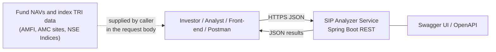

The service holds **no database and no external dependency**. Callers bring their data; the service performs deterministic calculations.

### 7.2 Layered architecture

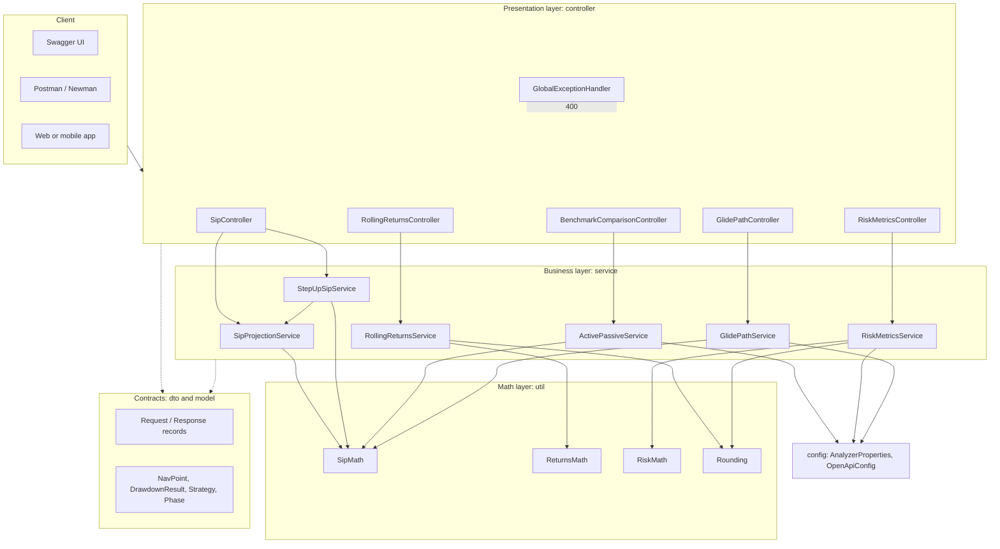

### 7.3 Layer responsibilities

| Layer | Responsibility | Rules |
|---|---|---|
| **Controller** | HTTP mapping, `@Valid` request validation, OpenAPI annotations | No business logic; delegates to one service |
| **Service** | Orchestrates a use case, applies defaults, validates business rules, assembles response DTOs | Stateless Spring singletons |
| **Util** | Pure static math: no Spring, no state, easy to unit-test | Final classes with private constructors |
| **DTO / Model** | Immutable Java `record`s as API contracts and small domain types | Validation annotations on requests |
| **Config** | Externalised defaults (`analyzer.*`), OpenAPI metadata | Bound by `@ConfigurationPropertiesScan` |

### 7.4 Request lifecycle

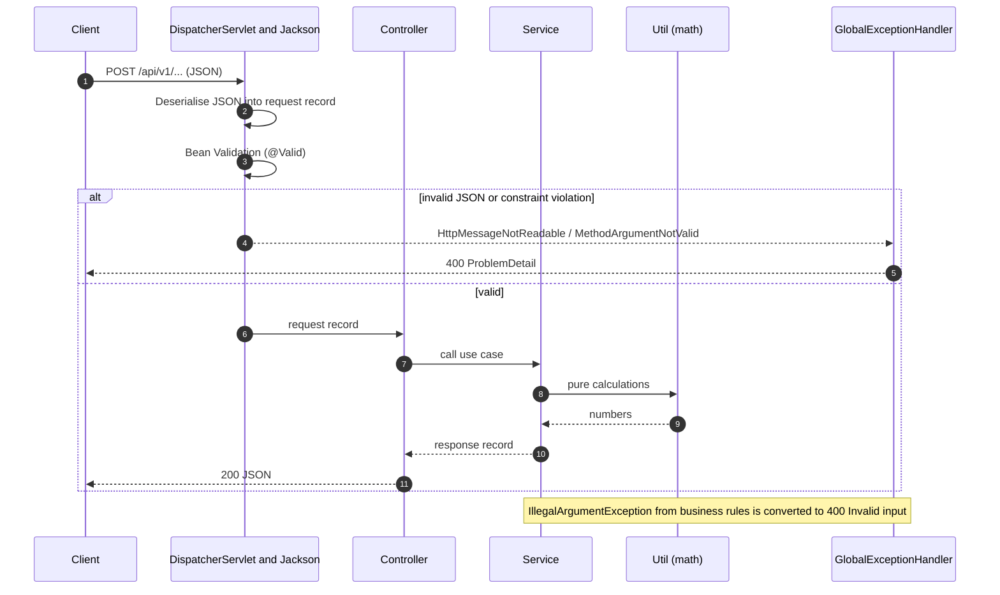

### 7.5 Non-functional design

| Aspect | Approach |
|---|---|
| Accuracy | `BigDecimal` DECIMAL128 for money; results rounded to 2 decimals only at the edge |
| Scalability | Stateless; scale horizontally behind a load balancer |
| Performance | Largest workload is O(n) over NAV points per window (a few thousand points); month-by-month simulation is at most 720 iterations |
| Security | No data stored; input bounded by validation (years 1-60, rates 0-100, TER 0-10). Add Spring Security/API gateway for production exposure |
| Observability | Add Spring Boot Actuator and metrics for production (see roadmap) |
| Documentation | OpenAPI + Postman collection with ~150 assertions |

---

## 8. Low-Level Design (LLD)

### 8.1 Package structure

```text
com.financial.sipanalyzer
├── SipAnalyzerApplication.java          # Spring Boot entry point
├── config/
│   ├── AnalyzerProperties.java          # analyzer.* defaults (Rf, TERs, debt return)
│   └── OpenApiConfig.java               # Swagger metadata
├── controller/
│   ├── SipController.java               # /sip/projection, /sip/step-up
│   ├── RollingReturnsController.java    # /returns/rolling
│   ├── BenchmarkComparisonController.java # /benchmark/active-vs-passive
│   ├── RiskMetricsController.java       # /risk/metrics
│   ├── GlidePathController.java         # /goals/glide-path
│   └── GlobalExceptionHandler.java      # centralised error mapping
├── dto/                                 # 14 request/response records
├── model/                               # NavPoint, DrawdownResult, Strategy, Phase
├── service/                             # 6 business services
└── util/                                # SipMath, ReturnsMath, RiskMath, Rounding
```

### 8.2 Class diagram: controllers and services

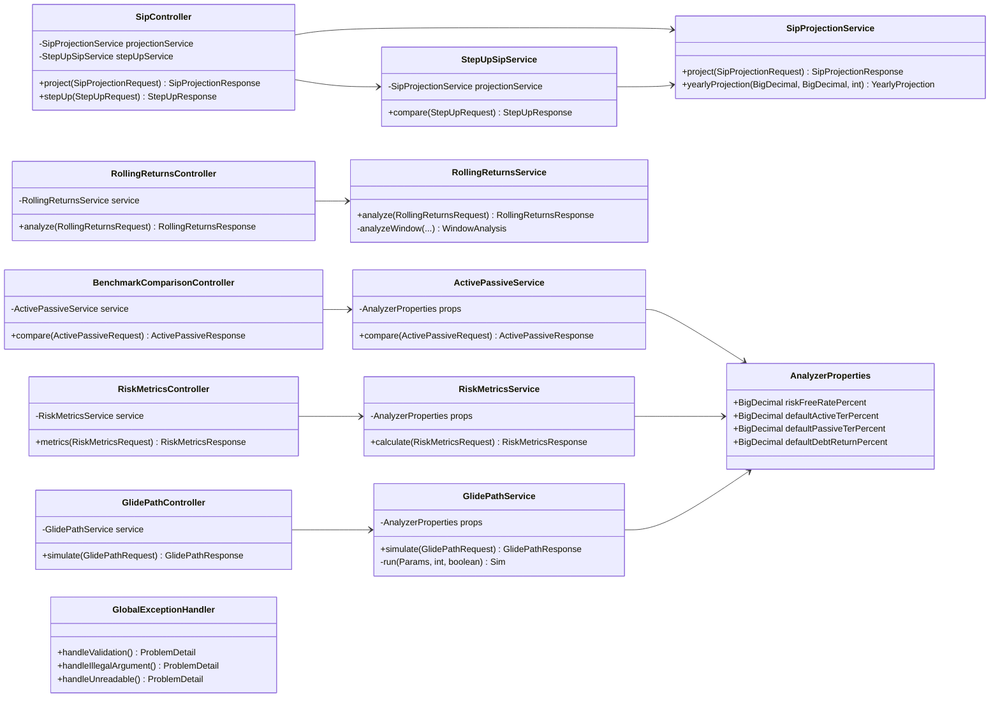

### 8.3 Class diagram: services and math utilities

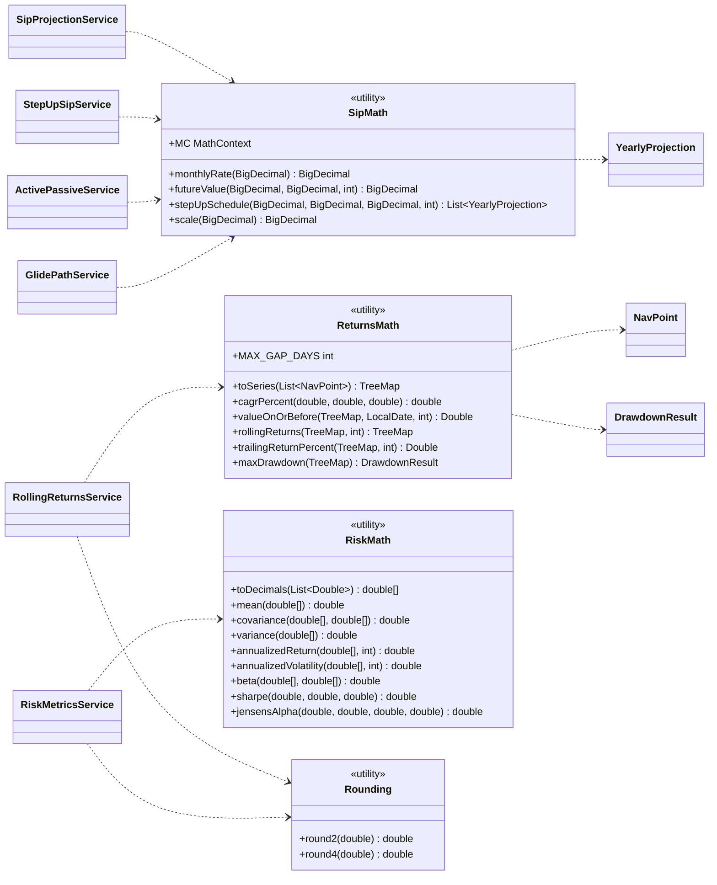

### 8.4 Class diagram: DTOs and models

```mermaid
classDiagram
    direction TB
    class NavPoint { LocalDate date; double nav }
    class DrawdownResult { double maxDrawdownPercent; LocalDate peakDate; LocalDate troughDate; LocalDate recoveryDate }
    class YearlyProjection { int year; BigDecimal monthlySip; BigDecimal totalInvested; BigDecimal wealthGain; BigDecimal finalCorpus }
    class ProjectionSummary { totalInvested; wealthGain; finalCorpus }
    class SipProjectionRequest
    class SipProjectionResponse
    class StepUpRequest
    class StepUpResponse
    class Delta
    class RollingReturnsRequest
    class RollingReturnsResponse
    class TrailingReturn
    class WindowAnalysis
    class ActivePassiveRequest
    class ActivePassiveResponse
    class HorizonResult
    class RiskMetricsRequest
    class RiskMetricsResponse
    class GlidePathRequest
    class GlidePathResponse
    class GlideOutcome
    class GlideYearPoint
    class Strategy { <<enum>> ACTIVE PASSIVE TIE }
    class Phase { <<enum>> ACCUMULATION GLIDE }

    SipProjectionResponse "1" o-- "*" YearlyProjection
    StepUpResponse "1" o-- "2" ProjectionSummary
    StepUpResponse "1" o-- "1" Delta
    StepUpResponse "1" o-- "*" YearlyProjection
    RollingReturnsRequest "1" o-- "*" NavPoint
    RollingReturnsResponse "1" o-- "*" TrailingReturn
    RollingReturnsResponse "1" o-- "*" WindowAnalysis
    RollingReturnsResponse "1" o-- "0..2" DrawdownResult
    ActivePassiveResponse "1" o-- "*" HorizonResult
    HorizonResult --> Strategy
    GlidePathResponse "1" o-- "2" GlideOutcome
    GlidePathResponse "1" o-- "*" GlideYearPoint
    GlideYearPoint --> Phase
```

`TrailingReturn`, `WindowAnalysis`, `Delta`, `HorizonResult`, `GlideOutcome` and `GlideYearPoint` are nested records inside their response types.

### 8.5 Sequence: SIP step-up comparison

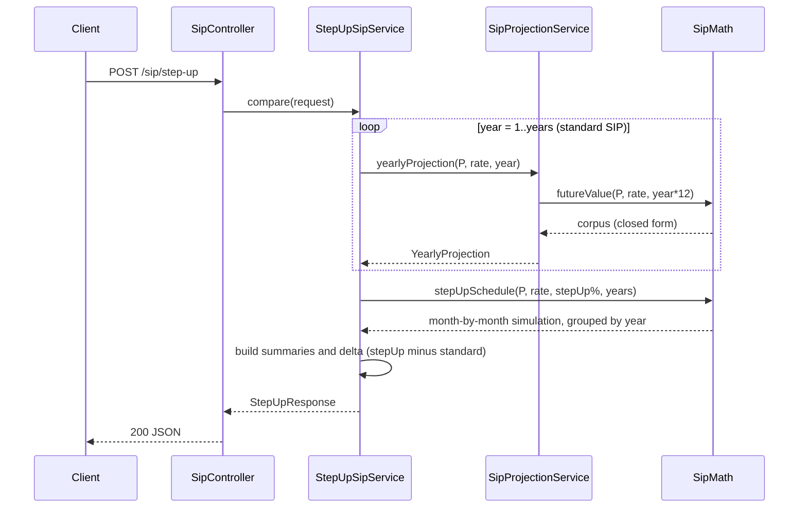

### 8.6 Sequence: rolling returns

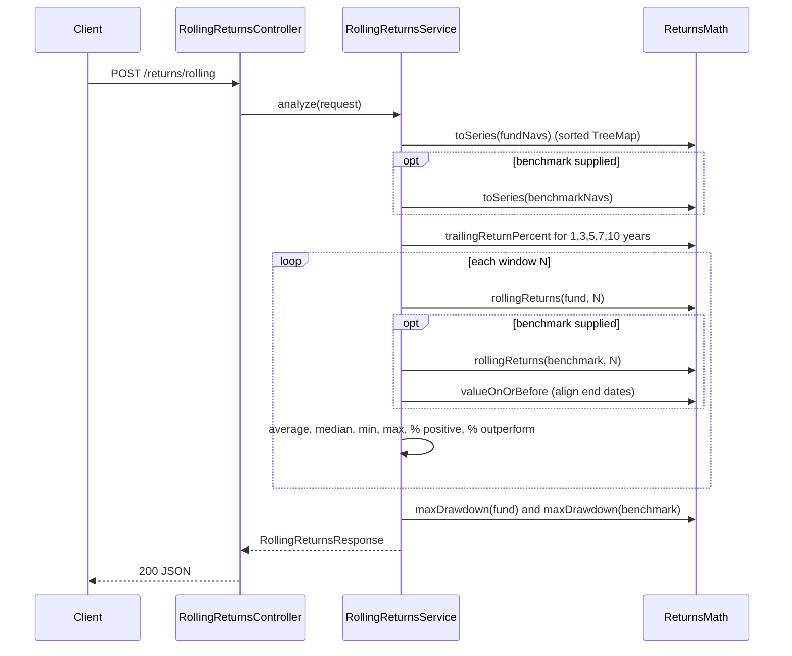

### 8.7 Algorithm flow: glide path simulation

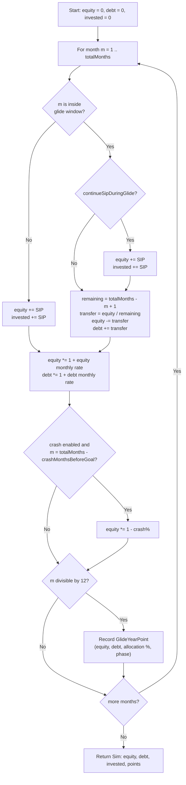

`GlidePathService.simulate` runs this loop **four times**: glide with and without crash, and full equity (glide window of 0 months) with and without crash. It then subtracts the results to produce `crashProtectionBenefit` and `opportunityCostWithoutCrash`.

### 8.8 Algorithm flow: risk metrics

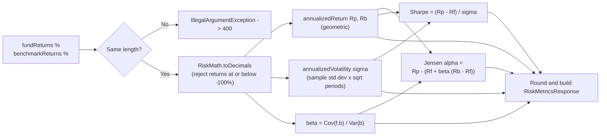

### 8.9 State of data: what is stored where

| Data | Where | Lifetime |
|---|---|---|
| Request payload | Java records in memory | One HTTP request |
| NAV series | `TreeMap<LocalDate, Double>` inside `ReturnsMath` calls | One HTTP request |
| Defaults | `AnalyzerProperties` bean (from `application.yml`) | Application lifetime |
| Nothing else | No database, no cache, no session | n/a |

---

## 9. Class catalogue: purpose and relationships

### 9.1 Entry point and configuration

| Class | Purpose | Relationships |
|---|---|---|
| `SipAnalyzerApplication` | Boots Spring; `@ConfigurationPropertiesScan` registers `AnalyzerProperties` | Scans all packages |
| `AnalyzerProperties` (record) | Externalised defaults: risk-free rate 6.5, active TER 0.70, passive TER 0.20, debt return 6.5 | Injected into `ActivePassiveService`, `RiskMetricsService`, `GlidePathService` |
| `OpenApiConfig` | Creates the `OpenAPI` bean (title, version, description) for Swagger UI | Used by springdoc |

### 9.2 Controllers (presentation layer)

| Class | Purpose | Depends on | Request / response |
|---|---|---|---|
| `SipController` | Exposes SIP projection and step-up | `SipProjectionService`, `StepUpSipService` | `SipProjectionRequest`/`Response`, `StepUpRequest`/`Response` |
| `RollingReturnsController` | Exposes rolling/trailing analysis | `RollingReturnsService` | `RollingReturnsRequest`/`Response` |
| `BenchmarkComparisonController` | Exposes active vs passive analysis | `ActivePassiveService` | `ActivePassiveRequest`/`Response` |
| `RiskMetricsController` | Exposes alpha/beta/Sharpe | `RiskMetricsService` | `RiskMetricsRequest`/`Response` |
| `GlidePathController` | Exposes glide-path simulation | `GlidePathService` | `GlidePathRequest`/`Response` |
| `GlobalExceptionHandler` | `@RestControllerAdvice` converting validation, business and parse errors to RFC 7807 `ProblemDetail` (HTTP 400) | Spring MVC exceptions | `ProblemDetail` |

### 9.3 Services (business layer)

| Class | Purpose | Depends on | Key logic |
|---|---|---|---|
| `SipProjectionService` | Builds the year-by-year schedule and milestone horizons (default 5/10/15/20) | `SipMath` | Closed-form SIP formula per year; `yearlyProjection` is reused by the step-up service |
| `StepUpSipService` | Compares standard and step-up SIPs over the same horizon | `SipProjectionService`, `SipMath` | Standard from the formula, step-up from monthly simulation; computes delta and % uplift |
| `RollingReturnsService` | Trailing returns (1/3/5/7/10y), rolling windows, benchmark outperformance %, drawdown | `ReturnsMath`, `Rounding` | Aligns benchmark windows to fund window end dates (7-day tolerance) |
| `ActivePassiveService` | Net-of-TER comparison of an active fund and an index fund at 10/15/20y | `SipMath`, `AnalyzerProperties` | Net return = gross - TER; expense drag = gross corpus - net corpus; winner enum |
| `RiskMetricsService` | Alpha, beta, Sharpe, volatility, excess return | `RiskMath`, `Rounding`, `AnalyzerProperties` | Validates equal length; geometric annualisation; sample statistics |
| `GlidePathService` | Equity-to-debt STP simulation with a crash stress test | `SipMath`, `AnalyzerProperties` | Four runs of a month-by-month two-bucket simulation (private records `Params`, `Sim`) |

### 9.4 Utilities (math layer)

| Class | Purpose | Used by |
|---|---|---|
| `SipMath` | `monthlyRate`, `futureValue` (SIP formula, zero-rate safe), `stepUpSchedule`, `scale` (2-decimals HALF_UP) | `SipProjectionService`, `StepUpSipService`, `ActivePassiveService`, `GlidePathService` |
| `ReturnsMath` | NAV series building, CAGR, nearest-date lookup, rolling returns, trailing returns, max drawdown with recovery | `RollingReturnsService` |
| `RiskMath` | Mean, covariance, variance, annualised return/volatility, beta, Sharpe, Jensen's alpha | `RiskMetricsService` |
| `Rounding` | `round2`/`round4` for doubles | `RollingReturnsService`, `RiskMetricsService` |

### 9.5 Models

| Class | Purpose |
|---|---|
| `NavPoint` | One NAV or index observation (`date`, `nav`); validated (`@NotNull`, `@Positive`) |
| `DrawdownResult` | Max drawdown %, peak/trough/recovery dates (recovery null if never regained) |
| `Strategy` (enum) | `ACTIVE`, `PASSIVE`, `TIE` winner label |
| `Phase` (enum) | `ACCUMULATION`, `GLIDE` year label in the glide schedule |

### 9.6 DTOs

| DTO | Direction | Used by | Notes |
|---|---|---|---|
| `SipProjectionRequest` | in | `SipProjectionService` | years 1-60, rate 0-100, optional `milestoneYears` |
| `SipProjectionResponse` | out | `SipProjectionService` | milestones and schedule |
| `YearlyProjection` | out (shared) | `SipMath`, services | one row of the schedule |
| `ProjectionSummary` | out | `StepUpSipService` | totals for one strategy |
| `StepUpRequest` / `StepUpResponse` (+ `Delta`) | in / out | `StepUpSipService` | |
| `RollingReturnsRequest` | in | `RollingReturnsService` | validated list of `NavPoint` |
| `RollingReturnsResponse` (+ `TrailingReturn`, `WindowAnalysis`) | out | `RollingReturnsService` | statistics are nullable when history is too short |
| `ActivePassiveRequest` / `ActivePassiveResponse` (+ `HorizonResult`) | in / out | `ActivePassiveService` | |
| `RiskMetricsRequest` / `RiskMetricsResponse` | in / out | `RiskMetricsService` | |
| `GlidePathRequest` / `GlidePathResponse` (+ `GlideOutcome`, `GlideYearPoint`) | in / out | `GlidePathService` | |

### 9.7 Test classes

| Test | Verifies |
|---|---|
| `SipMathTest` | Closed-form SIP, zero-rate, step-up 0% equals standard, step-up larger |
| `RiskMathTest` | Beta 1 and 2, sample standard deviation, Sharpe, alpha, geometric return |
| `ReturnsMathTest` | Drawdown peak/trough/recovery, rolling return of a doubling NAV |
| `RollingReturnsServiceTest` | 37/13 observations, average rolling return, benchmark outperformance, short history |
| `ActivePassiveServiceTest` | Breakeven alpha, passive wins at equal gross, active wins with alpha |
| `GlidePathServiceTest` | Crash protection vs opportunity cost, allocation falls to 0%, glide 0 equals equity, validation |
| `ApiIntegrationTest` | Full Spring context with MockMvc: 200 responses and 400 validation errors |

### 9.8 Dependency summary

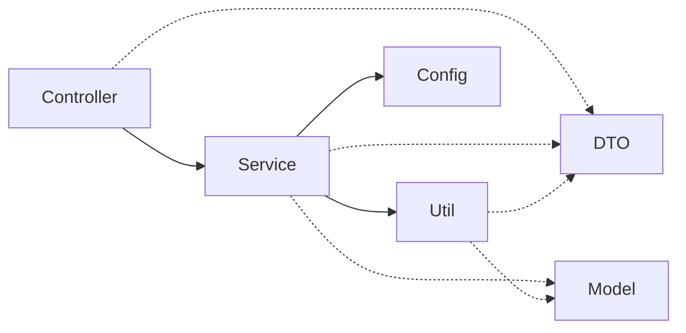

Dependencies only point **downwards** (Controller to Service to Util). Utilities never call services, so the math can be tested without Spring.

---

## 10. Mathematics and algorithms

| Topic | Formula / method | Implemented in |
|---|---|---|
| Monthly rate | `i = annual% / 12 / 100` | `SipMath.monthlyRate` |
| SIP future value (annuity-due) | `M = P x ((1+i)^n - 1) / i x (1+i)`; if `i = 0`, `M = P x n` | `SipMath.futureValue` |
| Step-up SIP | Loop each month: `balance = (balance + sip) x (1+i)`; every 12 months `sip = sip x (1 + step%)` | `SipMath.stepUpSchedule` |
| CAGR | `((end / start)^(1/years) - 1) x 100` | `ReturnsMath.cagrPercent` |
| Rolling return | CAGR between each date and the date `N` years earlier (nearest earlier NAV within 7 days) | `ReturnsMath.rollingReturns` |
| Max drawdown | Track running peak; worst `(nav - peak)/peak`; recovery = first later date with `nav >= that peak` | `ReturnsMath.maxDrawdown` |
| Annualised return | `exp(sum(ln(1+r)) x periodsPerYear / n) - 1` | `RiskMath.annualizedReturn` |
| Annualised volatility | `sample std dev x sqrt(periodsPerYear)` | `RiskMath.annualizedVolatility` |
| Beta | `Cov(fund, benchmark) / Var(benchmark)` (sample statistics) | `RiskMath.beta` |
| Jensen's alpha | `Rp - [Rf + beta x (Rb - Rf)]` | `RiskMath.jensensAlpha` |
| Sharpe ratio | `(Rp - Rf) / sigma` | `RiskMath.sharpe` |
| Net return after TER | `gross - TER` | `ActivePassiveService` |
| STP transfer | `equity / remaining months` each glide month, so equity is zero at the goal date | `GlidePathService.run` |

**Worked check:** 10,000/month, 12%, 10 years: `i = 0.01`, `n = 120`, `(1.01^120 - 1)/0.01 = 230.0387`, times `1.01` times `10,000` gives **23,23,391**, which matches the API.

---

## 11. Configuration, testing and Postman

### 11.1 `application.yml`

```yaml
analyzer:
  risk-free-rate-percent: 6.5
  default-active-ter-percent: 0.70
  default-passive-ter-percent: 0.20
  default-debt-return-percent: 6.5
server:
  port: 8080
```
Any value can be overridden per request (where the DTO exposes it) or by environment variable (for example `ANALYZER_RISKFREERATEPERCENT=7.0`).

### 11.2 Running tests

```bash
mvn clean test
```

### 11.3 Postman

Import `SIP-Analyzer.postman_collection.json` and `SIP-Analyzer.postman_environment.json`. The collection has 31 requests grouped by module with step-by-step descriptions and assertions. Run the whole collection from the Runner or via:

```bash
newman run SIP-Analyzer.postman_collection.json -e SIP-Analyzer.postman_environment.json
```

---

## 12. Assumptions, limitations and roadmap

### Assumptions

- Returns are **constant** in projections. Real returns vary year to year; use rolling returns to see the range.
- SIP instalments are invested at the **start** of each month.
- Net return is approximated as `gross - TER`.
- Equity-to-debt transfers in the glide path occur in equal monthly instalments of the remaining equity.
- The risk-free rate is a flat annual figure.

### Limitations

- **Taxes, exit loads, stamp duty and inflation are not modelled.** For goals, consider inflation-adjusting the target and checking current tax rules for equity, debt and gold/silver funds.
- The service **does not fetch NAV data**; callers supply it.
- Rolling returns need history at least as long as the window (a 5-year window needs more than 5 years of data).
- Alpha/beta from short return series (fewer than about 36 periods) are statistically weak.
- Past performance does not guarantee future results.

### Roadmap ideas

- Fetch NAVs from AMFI automatically and cache them.
- Inflation-adjusted (real) corpus and goal-target solver ("what SIP do I need for 2 crore in 15 years?").
- XIRR for irregular cash flows, SIP vs lump-sum comparison.
- Tax and exit-load aware net returns.
- Portfolio-level analysis (core-satellite allocation, correlation matrix).
- Spring Boot Actuator, Docker image and CI pipeline.

---

*Built with Spring Boot, Java 17 and a lot of compounding.*
